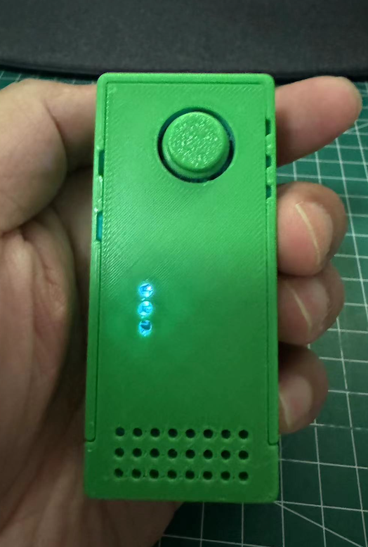

# YunDo Project Introduction

[English](./README.md) | [简体中文](./README_CN.md)

Welcome to the **YunDo** project GitHub page! YunDo is an open-source intelligent dialogue system based on large models.

## Project Content

### Simple Flow Chart
```plaintext
+------------------+                                  +-----------------+
|    Client (ESP32)  |                                  |     Server        |
|                  |                                  |                 |
| +--------------+ |                                  | +-------------+ |
| | Audio Capture | |                                  | | MQTT Broker | |
| +--------------+ |                                  | +------+------+ |
|        |          |                                  |        ^        |
|        v          |                                  |        |        |
| +--------------+  |                                  | +------+------| |
| | MQTT Publish  |  +------------------------------->  | | Receive Audio| |
| +--------------+  |                                  | +------+------| |
|                  |                                  +------+------| |
|                  |                                  |       v        |
|                  |                                  | +-------------+ |
|                  |                                  | | Speech-to-Text| <----> Azure Speech-to-Text API
|                  |                                  | +-------------+ |
|                  |                                  |       v        |
|                  |                                  | +-------------+ |
|                  |                                  | |    LLM Model   | <----> Dify.ai
|                  |                                  | +-------------+ |
|                  |                                  |       v        |
|                  |                                  | +-------------+ |
|                  |                                  | | Text-to-Speech| <----> Azure Text-to-Speech API
|                  |                                  | +-------------+ |
|                  v                                  |       v        |
| +--------------+  <---------------------------------+  | +-------------+ |
| | Audio Playback|                                     | | MQTT Publish  |
| +--------------+                                      | +-------------+ |
+------------------+                                   +-----------------+
```
### Hardware Overview
- **Complete Hardware with Enclosure**:




### Hardware
- Based on the open-source project [Esp32_VoiceChat_LLMs](https://github.com/MetaWu2077/Esp32_VoiceChat_LLMs)

### Firmware
- Based on MicroPython
- Provides complete firmware code and detailed configuration instructions

### Server
- Based on Python
- Integrates [dify.ai](https://dify.ai)'s large model capabilities
- Supports multiple models as described in [dify.ai](https://docs.dify.ai/getting-started/readme/model-providers)
- Utilizes Azure's TTS (Text-to-Speech) and STT (Speech-to-Text) services

## Key Features
- **Voice Interaction**: Implements natural language understanding and generation through large models, providing intelligent voice interaction experiences.
- **Voice Recognition and Synthesis**: Utilizes Azure's TTS and STT services for high-quality voice recognition and voice synthesis.
- **Open Source and Community-Driven**: All code are open-source, welcoming community contributions and collaboration.

## Quick Start
1. Clone this repository:
```
git clone https://github.com/hx23840/YunDo.git
```
2. Assemble the development board and flash the firmware according to the documentation.

3. Server Configuration

- Deploy the EMQX Broker:
  - Follow the official deployment steps: [Install EMQX](https://www.emqx.io/docs/en/latest/deploy/install-docker.html)
  - Configure user authentication as described here: [EMQX Authentication](https://www.emqx.io/docs/en/latest/access-control/authn/mnesia.html)

- Register with dify.ai and set up your application:
  - Register at [dify.ai Registration](https://docs.dify.ai/getting-started/cloud)
  - Create an application at [Creating an Application](https://docs.dify.ai/guides/application-design/creating-an-application)
  - Obtain API keys from [Developing with APIs](https://docs.dify.ai/guides/application-publishing/developing-with-apis)

- Utilizes Azure's TTS and STT services:
  - Register with Azure: [Azure Registration](https://portal.azure.com)
  - Create Azure TTS and STT services and obtain API keys
  
- Configure the parameters:
  - Copy the `.env.example` file to `.env` and update the parameters as needed.
```bash
cd Server
cp .env.example .env
```

5. Install dependencies and start the server:
```bash
pip install -r requirements.txt
python main.py
```

6. Start interacting with the intelligent dialogue system!

## Contribution
We welcome any form of contribution, including but not limited to:
- Bug fixes
- New feature submissions
- Improvement suggestions
- Documentation enhancements

## License
This project is licensed under the [GNU General Public License v3.0](./LICENSE).

## Contact Us
If you have any questions or suggestions, please submit them via [issues](./issues), or [email](mailto:peter@lyrai.app) our development team.

Thank you for your attention and support! Let's build a smarter and more open future together.
