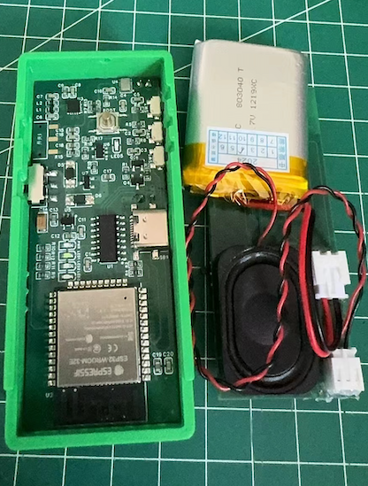

# YunDo 项目简介

欢迎来到 **YunDo** 项目的GitHub页面！YunDo 是一个基于大模型的智能对话系统。

## 项目内容
### 简易流程图
```plaintext
+------------------+                                  +-----------------+
|    客户端 (ESP32)  |                                  |     服务端         |
|                  |                                  |                 |
| +--------------+ |                                  | +-------------+ |
| | 声音采集模块   | |                                  | | MQTT 服务器 | |
| +--------------+ |                                  | +------+------+ |
|        |          |                                  |        ^        |
|        v          |                                  |        |        |
| +--------------+  |                                  | +------+------| |
| | MQTT 传输模块  |  +------------------------------->  | | 接收声音数据  | |
| +--------------+  |                                  | +------+------| |
|                  |                                  +------+------| |
|                  |                                  |       v        |
|                  |                                  | +-------------+ |
|                  |                                  | | 语音转文本模块  | <----> Azure 语音转文本 API
|                  |                                  | +-------------+ |
|                  |                                  |       v        |
|                  |                                  | +-------------+ |
|                  |                                  | | 大模型模块  | <----> Dify.ai
|                  |                                  | +-------------+ |
|                  |                                  |       v        |
|                  |                                  | +-------------+ |
|                  |                                  | | 文本转语音模块  | <----> Azure 文本转语音 API
|                  |                                  | +-------------+ |
|                  v                                  |       v        |
| +--------------+  <---------------------------------+  | +-------------+ |
| | 声音播放模块   |                                     | | MQTT 发送模块  |
| +--------------+                                      | +-------------+ |
+------------------+                                   +-----------------+
```

### 硬件概览
- **带外壳的完整硬件**:




### 硬件
- 使用开源项目 [Esp32_VoiceChat_LLMs](https://github.com/MetaWu2077/Esp32_VoiceChat_LLMs)

### 固件
- 基于 MicroPython
- 提供完整的固件代码和详细的配置说明

### 服务端
- 基于 Python
- 集成了 [dify.ai](https://dify.ai) 提供的大模型能力
- 支持 [dify.ai](https://docs.dify.ai/getting-started/readme/model-providers) 支持的多个模型
- 利用 Azure 的 TTS（文本转语音）和 STT（语音转文本）服务


## 主要功能
- **语音交互**: 通过大模型实现自然语言理解和生成，提供智能的语音交互体验。
- **语音识别和合成**: 利用 Azure 的 TTS 和 STT 服务，实现高质量的语音识别和语音合成。
- **开源和社区驱动**: 项目代码开源，欢迎社区贡献和合作。

## 快速开始
1. 克隆本仓库:
```
git clone https://github.com/hx23840/YunDo.git
```

2. 按照文档组装开发板并烧录固件。
- 给ESP32刷入MicroPython固件
  - 下载MicroPython固件：
    - 访问ESP32的MicroPython下载页面：[MicroPython for ESP32](https://micropython.org/download/ESP32_GENERIC/)
    - 下载ESP32的最新固件二进制文件。

  - 将固件刷入ESP32：
    - 按照MicroPython网站上的说明，将固件刷入您的ESP32设备。

- 设置Thonny IDE
  - 安装Thonny：
    - 从[Thonny官网](https://thonny.org)下载并安装Thonny IDE。
   
  - 拷贝固件文件：
    - 打开Thonny，并通过USB连接您的ESP32设备。
    - 使用Thonny的文件管理器导航到固件文件夹。
    - 将计算机上的固件文件夹中的MicroPython代码复制到ESP32中。

3. 服务端配置

- 部署 EMQX Broker:
  - 按照官方部署步骤：[安装 EMQX](https://www.emqx.io/docs/zh/latest/deploy/install-docker.html)
  - 根据此处描述配置用户认证：[EMQX 认证](https://www.emqx.io/docs/zh/latest/access-control/authn/mnesia.html)

- 在 dify.ai 注册并设置您的应用程序:
  - 在 [dify.ai 注册](https://docs.dify.ai/v/zh-hans/getting-started/cloud) 完成注册
  - 在 [创建应用程序](https://docs.dify.ai/v/zh-hans/guides/application-design/creating-an-application) 创建应用
  - 从 [使用 API 开发](https://docs.dify.ai/v/zh-hans/guides/application-publishing/developing-with-apis) 获取 API 密钥

- 使用Azure的TTS和STT服务:
  - 在Azure上注册: [Azure Registration](https://portal.azure.com)
  - 创建Azure TTS和STT服务并获取API密钥
  
 - 配置参数: 将 `.env.example` 文件复制为 `.env` 并根据需要更新参数。
```bash
cd Server
cp .env.example .env
```

5. 安装依赖并启动服务端:
```bash
pip install -r requirements.txt
python main.py
```

6. 开始与智能对话系统进行交互！

## 贡献
我们欢迎任何形式的贡献，包括但不限于：
- 修复 Bug
- 提交新功能
- 提出改进建议
- 完善文档

## 开源协议
本项目采用 [GNU 通用公共许可证 v3.0](./LICENSE) 开源协议。

## 联系我们
如果您有任何问题或建议，请通过 [issues](https://github.com/hx23840/YunDo/issues) 提交，或者[发送邮件](mailto:peter@lyrai.app)至我们的开发团队

感谢您的关注和支持！一起构建更加智能和开放的未来。
